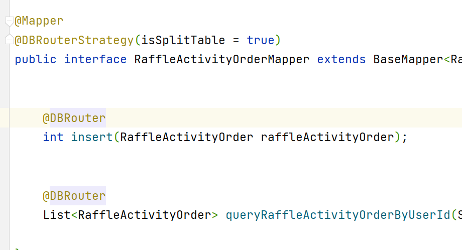

# 配置案例

```yaml
custom-db-router:
  jdbc:
    datasource:
      dbCount: 2
      tbCount: 4
      default: db00
      routerKey: userId
      list: db01,db02
      db00:
        driver-class-name: com.mysql.cj.jdbc.Driver
        url: jdbc:mysql://127.0.0.1:3306/xx?useUnicode=true&characterEncoding=utf8&autoReconnect=true&zeroDateTimeBehavior=convertToNull&serverTimezone=UTC&useSSL=true
        username: root
        password: 123456
        type-class-name: com.zaxxer.hikari.HikariDataSource
        pool:
          pool-name: Retail_HikariCP
          minimum-idle: 15 #最小空闲连接数量
          idle-timeout: 180000 #空闲连接存活最大时间，默认600000（10分钟）
          maximum-pool-size: 25 #连接池最大连接数，默认是10
          auto-commit: true  #此属性控制从池返回的连接的默认自动提交行为,默认值：true
          max-lifetime: 1800000 #此属性控制池中连接的最长生命周期，值0表示无限生命周期，默认1800000即30分钟
          connection-timeout: 30000 #数据库连接超时时间,默认30秒，即30000
          connection-test-query: SELECT 1
      db01:
        driver-class-name: com.mysql.cj.jdbc.Driver
        url: jdbc:mysql://127.0.0.1:3306/xx_01?useUnicode=true&characterEncoding=utf8&autoReconnect=true&zeroDateTimeBehavior=convertToNull&serverTimezone=UTC&useSSL=true
        username: root
        password: 123456
        type-class-name: com.zaxxer.hikari.HikariDataSource
        pool:
          pool-name: Retail_HikariCP
          minimum-idle: 15 #最小空闲连接数量
          idle-timeout: 180000 #空闲连接存活最大时间，默认600000（10分钟）
          maximum-pool-size: 25 #连接池最大连接数，默认是10
          auto-commit: true  #此属性控制从池返回的连接的默认自动提交行为,默认值：true
          max-lifetime: 1800000 #此属性控制池中连接的最长生命周期，值0表示无限生命周期，默认1800000即30分钟
          connection-timeout: 30000 #数据库连接超时时间,默认30秒，即30000
          connection-test-query: SELECT 1
      db02:
        driver-class-name: com.mysql.cj.jdbc.Driver
        url: jdbc:mysql://127.0.0.1:3306/xx_02?useUnicode=true&characterEncoding=utf8&autoReconnect=true&zeroDateTimeBehavior=convertToNull&serverTimezone=UTC&useSSL=true
        username: root
        password: 123456
        type-class-name: com.zaxxer.hikari.HikariDataSource
        pool:
          pool-name: Retail_HikariCP
          minimum-idle: 15 #最小空闲连接数量
          idle-timeout: 180000 #空闲连接存活最大时间，默认600000（10分钟）
          maximum-pool-size: 25 #连接池最大连接数，默认是10
          auto-commit: true  #此属性控制从池返回的连接的默认自动提交行为,默认值：true
          max-lifetime: 1800000 #此属性控制池中连接的最长生命周期，值0表示无限生命周期，默认1800000即30分钟
          connection-timeout: 30000 #数据库连接超时时间,默认30秒，即30000
          connection-test-query: SELECT 1


```


